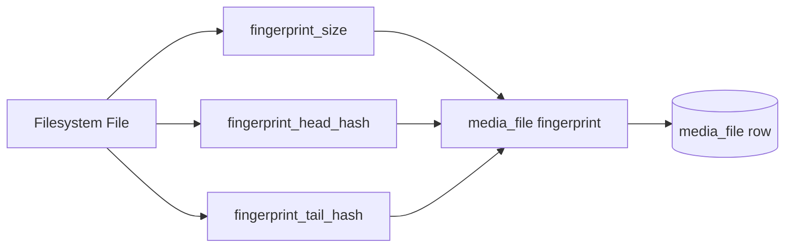

# Data Contracts & Guardrails

Majestic enforces explicit data domains and invariants.

See also: [Data Lineage](data-lineage.md), [Identity Layer](identity-layer.md)

---

## 1. Fingerprint as Continuity Backbone

File identity continuity is guaranteed by deterministic fingerprinting, not by path.

**Invariants:**

| Mutable | Immutable |
|---------|-----------|
| File path | Fingerprint |
| File name | |
| Library root | |

Fingerprint is authoritative. Fingerprint algorithm is versioned. `media_file` must store `fingerprint_version` to support future algorithm changes without breaking continuity. Changes require migration path. Never weaken fingerprint determinism for speed.

---

## 2. Data Domains

### Identity Domain (Immutable)

**Purpose:** Define ownership and edition truth.

**Includes:** disc_edition identity hash, UPC, region, packaging, publisher, release year, edition-level deterministic fields.

**Rules:** Never derived from media_file. Never mutated by enrichment. Hash inputs must remain stable across rescans.

---

### Enrichment Domain (Mutable)

**Purpose:** Improve presentation.

**Includes:** TMDB ID, overview, cast, runtime, genres, artwork metadata.

**Rules:** Must never modify identity fields. Safe to refresh. Safe to delete and re-fetch. Should tolerate external API instability.

---

### Playback Domain (Minimal & Deterministic)

**Purpose:** Direct streaming.

**Includes:** media_file path, fingerprint_size, fingerprint_head_hash, fingerprint_tail_hash, container/codec probe data, playback_prediction.

**Rules:** Must not depend on enrichment. Must remain functional even if enrichment data is entirely absent. Must function without artwork. Must survive library aggregation failure. Must tolerate temporary DB write lock.

---

## 3. Risks & Guardrails

### Orchestration Blast Radius

**Risk:** Orchestration coordinates identity, enrichment, copies, and import.

**Guardrail:** Orchestration coordinates only. Identity logic lives in identity modules. Enrichment logic lives in enrichment modules. Streaming logic never depends on orchestration.

### Enrichment Overreach

**Risk:** External API writes overwrite identity data.

**Guardrail:** Enrichment writes only to enrichment-scoped columns. Identity columns must not be modified outside identity modules.

### Artwork Coupling

**Risk:** Artwork tied to media_file existence.

**Guardrail:** Artwork attaches to movie identity. Deleting media_file must not delete artwork. Artwork pipeline must be idempotent.

### Fingerprint Drift

**Risk:** Hash algorithm changes silently. Partial hashing introduced. Performance shortcut reduces uniqueness.

**Guardrail:** Fingerprint algorithm versioned. media_file must store fingerprint_version to support future algorithm changes without breaking continuity. Changes require migration path. Never weaken fingerprint determinism for speed.
