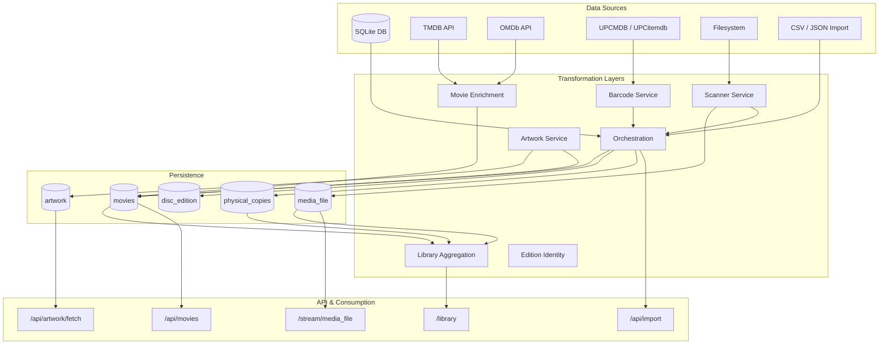
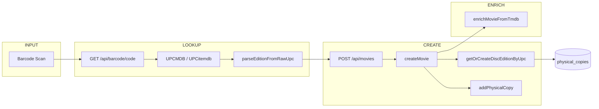
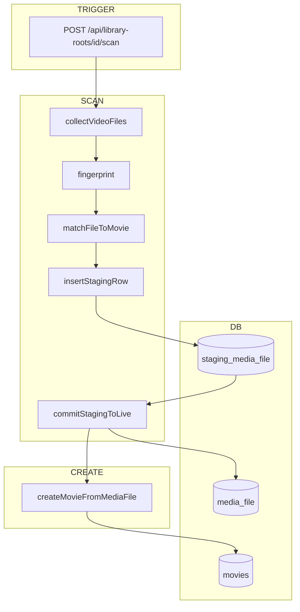
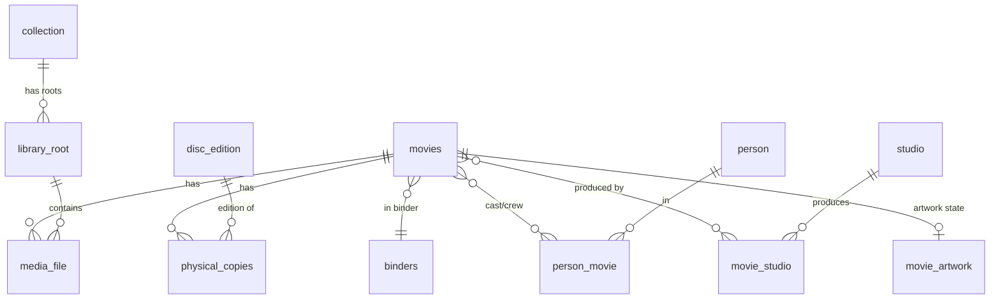
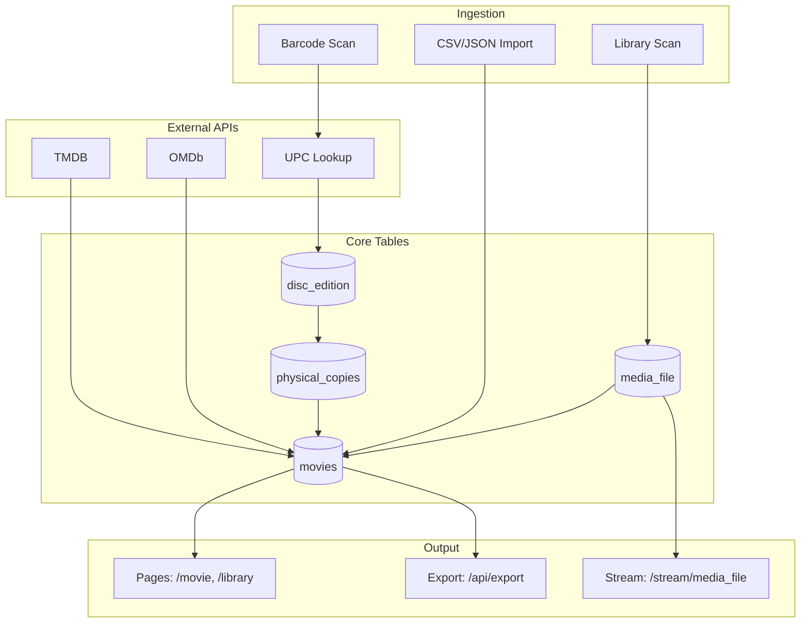

# Data Lineage

Data flow from sources through transformations to consumption.

**See also:** [Identity Layer](identity-layer.md) (invariants and guardrails)

---

## 1. Overall Data Lineage

---

## 2. Physical Disc Flow (Barcode Scan)

---

## 3. Library Scan Flow (Digital Files)

---

## 4. Core Entity Relationships

---

## 5. End-to-End Data Flow Summary

